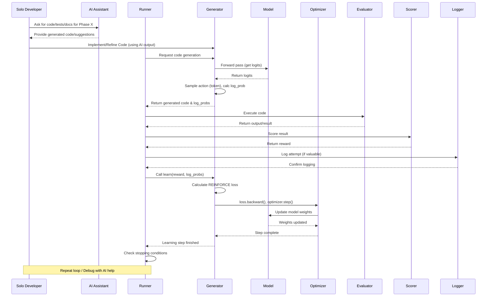

## Revised AltLAS PyTorch Transition Plan (v2 - Solo Dev + AI Edition)

**1. Introduction & Overarching Principles**

*   **Goal:** Transition AltLAS's core learning mechanism from simple weights to a PyTorch-based Reinforcement Learning (RL) model (initially REINFORCE with an RNN/LSTM/GRU), enabling GPU acceleration and complex behavior learning. This revision adapts the plan for execution by a **single developer leveraging AI coding assistants** (like Claude, Copilot, etc.) and integrates rigorous software development practices.
*   **Alignment:** This plan adheres to the AltLAS philosophies (modularity, bottom-up learning, minimal dependencies where practical) outlined in `AltLAS_Project_Guide.md`.
*   **Solo Developer + AI Strategy:**
    *   **AI as Pair Programmer:** Use AI for brainstorming, code generation, refactoring, explaining concepts, identifying potential bugs, generating tests, and drafting documentation. *Treat AI suggestions critically; always review and test.*
    *   **Incremental Steps:** Break down each phase into small, verifiable tasks.
    *   **Version Control:** Use Git diligently. Commit frequently with clear messages after each small success. Create branches for significant features (e.g., `feature/pytorch-model`, `feature/reinforce-logic`).
    *   **Testing is Key:** Rely heavily on automated tests (unit and integration) to catch regressions and validate logic, compensating for the lack of human code review.
    *   **Logging & Debugging:** Implement detailed logging to track agent behavior and diagnose issues. Use AI to help interpret logs and suggest debugging strategies.
    *   **Documentation:** Maintain clear documentation (code comments, this plan, README) to track progress and decisions. AI can help generate drafts.
*   **Software Engineering Practices:**
    *   **Coding Standards:** Adhere to PEP 8. Use type hinting (`typing` module). Employ clear, descriptive variable and function names. Use a consistent docstring format (e.g., Google or NumPy style). *AI Tooling: Use linters/formatters (like Black, Flake8) integrated into the IDE, potentially configured/suggested by AI.*
    *   **Modularity:** Design new components (tokenizer, model, RL logic) as distinct modules with clear interfaces, respecting the existing AltLAS structure. *AI Tooling: Ask AI to review code for modularity and suggest refactoring.*
    *   **Testing Pyramid:** Implement unit tests for individual components and integration tests for workflows.
    *   **Configuration:** Manage hyperparameters and settings via `config.ini`.

**2. Phase 1: Setup and Prerequisites**

*   **Original Actions:**
    1.  Install PyTorch with CUDA Support (`.devcontainer/Dockerfile`, rebuild container).
    2.  Implement GPU/CPU device detection and consistent usage (`runner.py` or `utils.py`).
*   **SE Practices:**
    *   Clearly document the chosen PyTorch/CUDA versions and installation method in the Dockerfile comments and potentially a `CONTRIBUTING.md` or `SETUP.md`.
*   **Testing Strategy:**
    *   *Unit Test:* Create a test for the device detection logic (`test_device_detection.py`) ensuring it correctly identifies CPU/GPU and returns the expected `torch.device` object.
*   **Documentation Strategy:**
    *   Add a section to the project `README.md` detailing the environment setup, including PyTorch/CUDA installation.
*   **AI Assistant Integration:**
    *   *Prompt Example:* "Show me the current recommended pip command to install PyTorch version X.Y with CUDA Z.Z support on Linux."
    *   *Prompt Example:* "Write a Python function using the `torch` library that detects if CUDA is available and returns the appropriate `torch.device` ('cuda' or 'cpu'). Include error handling for potential Torch installation issues."
    *   *Prompt Example:* "Draft a README section explaining how to set up the development environment, including the PyTorch and CUDA requirements based on this Dockerfile."
*   **Solo Dev Considerations:**
    *   Verify the PyTorch and CUDA installation *inside the running dev container* (`python -c "import torch; print(torch.__version__); print(torch.cuda.is_available())"`) before proceeding. This avoids debugging installation issues later.

**3. Phase 2: Data Representation**

*   **Original Actions:**
    1.  Define fixed vocabulary (`all_elements` + special tokens) and store persistently (`memory/vocab.json`).
    2.  Create `tokenizer.py` with `encode`/`decode` functions (string <-> tensor of IDs).
*   **SE Practices:**
    *   Define a clear, documented JSON structure for `vocab.json`.
    *   Ensure `tokenizer.py` is a self-contained module with no dependencies on the agent core logic. Use type hints for function signatures.
*   **Testing Strategy:**
    *   *Unit Tests (`test_tokenizer.py`):*
        *   Test `encode` for known inputs and expected ID sequences.
        *   Test `decode` for known ID sequences and expected string outputs.
        *   Test handling of special tokens (`<PAD>`, `<SOS>`, `<EOS>`).
        *   Test handling of unknown words/elements (mapping to `<UNK>`).
        *   Test encoding/decoding empty strings or sequences.
        *   Test consistency: `decode(encode(s)) == s` (for strings within vocab).
*   **Documentation Strategy:**
    *   Document the `vocab.json` format.
    *   Add clear docstrings to `tokenizer.py` explaining its purpose, methods (`encode`, `decode`), and parameters.
*   **AI Assistant Integration:**
    *   *Prompt Example:* "Generate Python code for a `Tokenizer` class. It should load a vocabulary from a JSON file ('vocab.json') during initialization. Implement `encode(text: str) -> torch.Tensor` and `decode(tensor: torch.Tensor) -> str` methods. Include handling for PAD, SOS, EOS, UNK tokens. Use type hints."
    *   *Prompt Example:* "Generate unit tests using `pytest` for the `Tokenizer` class, covering encoding, decoding, special tokens, and unknown words."
    *   *Prompt Example:* "Generate Google-style docstrings for this Tokenizer class and its methods."
*   **Solo Dev Considerations:**
    *   Manually inspect the initial `vocab.json` for correctness. Test the tokenizer thoroughly in isolation before integrating it into the agent.

**4. Phase 3: Model Definition**

*   **Original Actions:**
    1.  Create `agent_core/model.py`.
    2.  Define `AltLAS_RNN(nn.Module)` with Embedding, RNN (LSTM/GRU), Linear layers.
    3.  Ensure random weight initialization (default).
    4.  Define `forward` method.
*   **SE Practices:**
    *   Use descriptive names for layers within the model.
    *   Add type hints to the `__init__` and `forward` methods.
    *   Keep the model definition focused solely on the network architecture and forward pass. Initialization and device placement should happen where the model is instantiated (e.g., in `CodeGenerator`).
*   **Testing Strategy:**
    *   *Unit Tests (`test_model.py`):*
        *   Test model instantiation.
        *   Test the `forward` pass with dummy input tensors (correct shapes, device). Verify output tensor shape and device.
        *   Test model's ability to be moved to the target device (`model.to(device)`).
*   **Documentation Strategy:**
    *   Add docstrings to `agent_core/model.py` explaining the model architecture, parameters, and the expected input/output of the `forward` method.
*   **AI Assistant Integration:**
    *   *Prompt Example:* "Generate a PyTorch `nn.Module` class named `AltLAS_RNN`. It should have an embedding layer, an LSTM layer, and a linear output layer. Take vocab_size, embedding_dim, hidden_dim as init arguments. Implement the forward method. Include type hints and basic docstrings."
    *   *Prompt Example:* "Generate a `pytest` unit test for the `AltLAS_RNN` model. It should instantiate the model, create dummy input tensors (batch_size, sequence_length) on the CPU, run the forward pass, and assert the output tensor has the expected shape (batch_size, sequence_length, vocab_size)."
*   **Solo Dev Considerations:**
    *   Start with the simplest architecture (e.g., single-layer LSTM) as planned. Verify its forward pass works correctly before considering more complex variations. Use `torchinfo` or similar tools to visualize the model structure and parameter counts.

**5. Phase 4: Core Logic Replacement**

*   **Original Actions:**
    1.  Update `CodeGenerator` to use the PyTorch model for generation (sampling loop, log-probabilities).
    2.  Replace `_update_weights` with `learn(reward, log_probs)` implementing REINFORCE. Instantiate optimizer (`Adam`). Perform update step.
*   **SE Practices:**
    *   Decouple the generation *sampling* logic from the model's `forward` pass. The model outputs logits; the sampling logic (softmax, `torch.multinomial`) resides in `CodeGenerator`.
    *   Make the RL algorithm choice potentially configurable or easily swappable later (though starting with REINFORCE is fine).
    *   Pass hyperparameters like learning rate via the config file.
*   **Testing Strategy:**
    *   *Unit Tests (`test_generator.py`):*
        *   Test the generation sampling logic: given dummy logits, does it produce token IDs? Do probabilities (after softmax) sum to ~1?
        *   Test the `learn` method: given dummy log-probs and a reward, does the loss calculation produce a scalar tensor? Does calling `optimizer.step()` change model parameters? (Check `model.parameters()` before and after).
    *   *Integration Test (`test_generation_learning_loop.py`):*
        *   Create a mini-loop: instantiate model, optimizer, generator logic. Generate a short sequence. Provide a dummy reward. Call `learn`. Check that loss is computed and optimizer step runs without errors.
*   **Documentation Strategy:**
    *   Document the new generation process within `CodeGenerator` docstrings.
    *   Document the `learn` method, explaining the RL algorithm (REINFORCE), inputs, and actions.
*   **AI Assistant Integration:**
    *   *Prompt Example:* "Show Python code for a loop that generates a sequence of token IDs using a PyTorch RNN model. Start with an SOS token. In each step, feed the current token and hidden state to the model, get logits, apply softmax, sample the next token using `torch.multinomial`, and collect the token and its log-probability. Stop on EOS or max length."
    *   *Prompt Example:* "Implement the REINFORCE policy gradient loss calculation in PyTorch. The inputs are a list/tensor of log-probabilities for a trajectory and a final scalar reward (return). The loss should be the negative sum of log-probs weighted by the return."
    *   *Prompt Example:* "Refactor this `CodeGenerator` class. Extract the PyTorch model interaction and RL learning logic into separate helper methods."
    *   *Prompt Example:* "Generate unit tests for the REINFORCE loss calculation function."
*   **Solo Dev Considerations:**
    *   Test generation and learning independently first. Use `print` statements or a debugger liberally during initial implementation. Ensure tensors are on the correct device, especially before loss calculation and backpropagation. Start with a very small vocabulary/model for faster debugging cycles.

**6. Phase 5: Integration and Persistence**

*   **Original Actions:**
    1.  Update `CodeGenerator.__init__` to load vocab, instantiate tokenizer, model (to `device`), optimizer, and load saved states.
    2.  Ensure consistent tensor device placement.
    3.  Update saving/loading to use `torch.save`/`torch.load` for model and optimizer `state_dict()`.
*   **SE Practices:**
    *   Implement robust error handling for loading files (vocab, model state, optimizer state) – what happens if files are missing or corrupted?
    *   Organize saved artifacts logically (e.g., in a dedicated `checkpoints/` directory specified in `config.ini`).
*   **Testing Strategy:**
    *   *Integration Tests (`test_persistence.py`, `test_runner_integration.py`):*
        *   Test saving the model and optimizer states.
        *   Test loading the states into new instances of the model and optimizer. Verify the parameters match the saved ones.
        *   Test a full run: Initialize -> Run loop for a few steps -> Save state -> Shutdown -> Initialize new agent -> Load state -> Verify state loaded correctly -> Run a few more steps.
*   **Documentation Strategy:**
    *   Document the saving/loading process, including the file paths (or how they are configured) and the expected format. Update `README.md` if necessary.
*   **AI Assistant Integration:**
    *   *Prompt Example:* "Show the standard PyTorch code for saving and loading the state dictionaries of a model and an Adam optimizer. Include checks for file existence during loading."
    *   *Prompt Example:* "Review this Python code snippet and identify any potential issues with PyTorch tensor device placement."
    *   *Prompt Example:* "Design an integration test scenario using `pytest` to verify that the AltLAS agent can save its PyTorch model and optimizer state, be reloaded, and continue training."
*   **Solo Dev Considerations:**
    *   Persistence bugs can be subtle. Test saving/loading thoroughly. Ensure you save both model *and* optimizer states, otherwise learning might behave unexpectedly after loading. Version your checkpoints if making significant architectural changes.

**7. Phase 6: Configuration and Refinement**

*   **Original Actions:**
    1.  Update `config.ini` with model/optimizer hyperparameters and paths.
    2.  Test thoroughly, debug, verify device placement, loss trends, etc.
*   **SE Practices:**
    *   Group related parameters in `config.ini` under clear sections (e.g., `[model]`, `[optimizer]`, `[paths]`). Add comments explaining each parameter.
    *   Implement structured logging (using Python's `logging` module) to track training progress (episode, reward, loss) and potential issues. Log key configuration parameters at the start of a run.
*   **Testing Strategy:**
    *   *Integration Tests:* Run the full agent loop on one or two simple, actual tasks defined in the `task/` directory (e.g., a simplified "hello world" or basic arithmetic). Verify that it runs end-to-end without crashing.
    *   *Debugging:* Analyze logs for loss trends (is it decreasing? oscillating? exploding?), reward trends, and generated code quality over time.
*   **Documentation Strategy:**
    *   Update `README.md` with final instructions on how to run the agent, configure it via `config.ini`, and interpret the output/logs.
*   **AI Assistant Integration:**
    *   *Prompt Example:* "Suggest reasonable default values and ranges for hyperparameters like embedding_dim, hidden_dim, and learning_rate for an LSTM model training on code generation using REINFORCE."
    *   *Prompt Example:* "Generate Python code using the `logging` module to log training metrics (episode number, total reward, loss) to both the console and a file ('training.log')."
    *   *Prompt Example:* "My REINFORCE loss is consistently NaN. Here's my loss calculation code and the preceding steps. What are common reasons for this and how can I debug it?"
    *   *Prompt Example:* "Draft the 'Usage' section for the README, explaining how to run the main script (`runner.py`) and configure parameters in `config.ini`."
*   **Solo Dev Considerations:**
    *   RL training can be unstable. Start with simple tasks and very small models. Monitor training closely. Don't expect immediate success; focus on getting the mechanics working first. Systematically track experiments (hyperparameters, code versions, results).

**8. Mermaid Diagram: AI-Assisted Training Loop**

**9. Conclusion**

This revised plan provides a detailed roadmap for transitioning AltLAS to PyTorch, specifically tailored for a solo developer leveraging AI assistance. By integrating software engineering best practices, comprehensive testing, and explicit strategies for AI collaboration and solo development risk mitigation, the transition aims to be robust, manageable, and aligned with AltLAS's long-term goals.